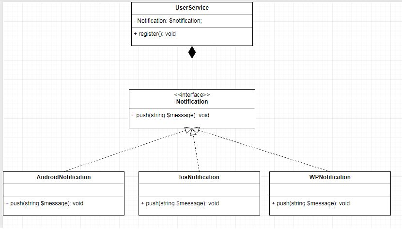
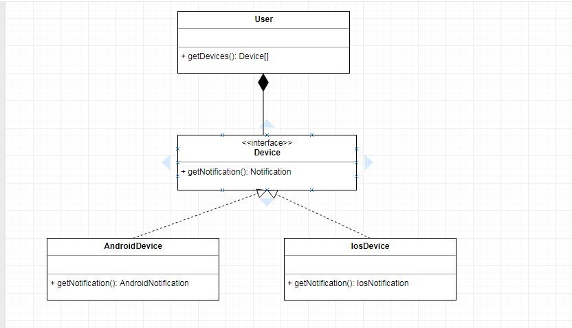

# Open Closed principle

## Requirement:
- Customer have 2 device Ios and Android
- Then customer register account will notification to 2 device.

## Design
1. Notification Interface
2. AndroidNotification class
3. IosNotification class
4. Device interface
4. AndroidDevice class
4. IosDevice class

## Refs
https://code.tutsplus.com/tutorials/solid-part-2-the-openclosed-principle--net-36600